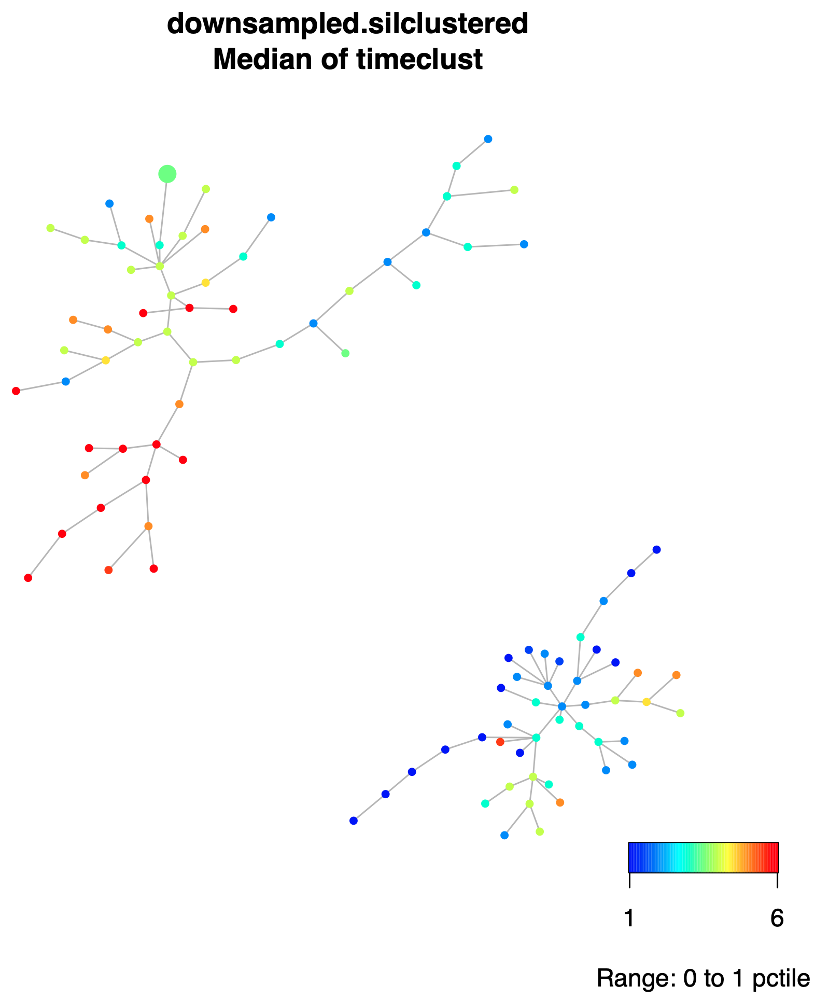
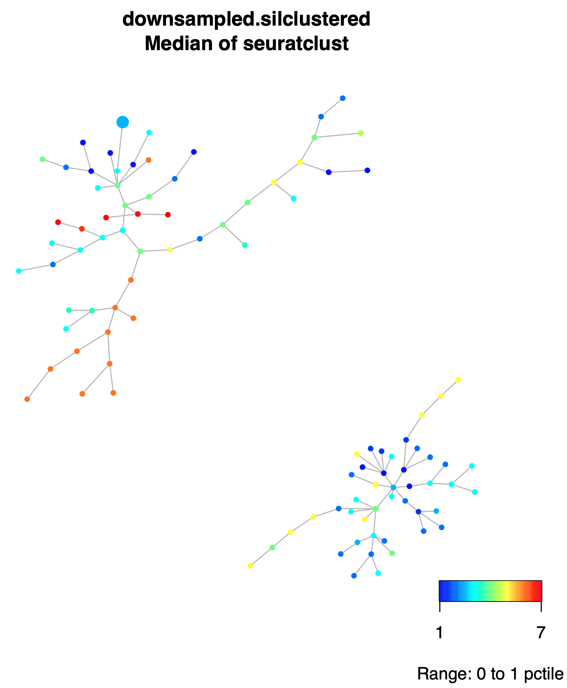

```{r setup, include=FALSE}
knitr::opts_chunk$set(echo = TRUE)
```

# Introduction

This page contains instructions about how to install, and run the R codes implementing the Dynamic Spanning Forest Mixtures (DSFMix), a novel pipeline to analyze single-cell (scRNA-seq or CyTOF) data collected at different time points, that produces a mixture of Minimum Spanning Trees (MSTs) as outputs. Given the nature of the single-cell experiments, it is also possible to just run DSFMix with single-cell data collected at a single time point.

DSFMix uses decision-tree models to select markers (i.e. genes from scRNA-seq or antigenic proteins in the case of CyTOF) that account for variation in multimodality, skewness and time. These markers are subsequently used to build the forest (i.e. mixtures of trees), using tree agglomerative hierarchical clustering (THAC) and dynamic branch cutting. For further detail, please refer to our forthcoming publication @anchang2022 .

# Installation

Clone this repository within a given folder on your local computer. Then follow the subsequent steps.

## Windows users

Prior to install the source package **spade** (provided as file **spade_1.0.0.tar.gz** within this repository), you need to install Rtools, which makes compiler and compiler utilities (such as *make*, *bash*, etc.) available to the R environment. Please refer to the instructions in CRAN regarding installation of [Rtools4](https://cran.r-project.org/bin/windows/Rtools/) that is required by >R.4.0.0. For older versions of R, check also the corresponding versions of Rtools [https://cran.r-project.org/bin/windows/Rtools/history.html](https://cran.r-project.org/bin/windows/Rtools/history.html).

Once Rtools is installed, you need to add the location of Rtools utilities in the definition of your PATH, so that R can have access to them. This is done by re-defining your PATH in the **.Renviron** file that should be placed in your **Documents** folder. You can do this by either creating a text file with the new path or else, from the R console executing the following command (assuming Rtools4 is installed):

```{r, eval=FALSE}
write('PATH="${RTOOLS40_HOME}\\usr\\bin;${PATH}"', file = "~/.Renviron", append = TRUE)
```

The best way to test whether Rtools path has been added properly you your PATH, is to quit the current R session and upon restart, type:

```{r, eval=FALSE}
Sys.which("make")
## "C:\\rtools40\\usr\\bin\\make.exe" It should produce this answer
## (unless another driver D,.. etc has been used)
```

You are good to compile/install R source files (such as **spade_1.0.0.tar.gz**).

## macOS users

The installation script referred below should work "as is" on mac (it has been tested on macOS Catalina running R.4.1.0), but as note of caution, We must say that there is a problem with **misc3d** package. The current and recent versions of the package are able to install, BUT they do not load (at least on macOS Catalina running R.4.1.0, we have not tested in other macOS and/or R versions). As a result, the package **plot3D**, which is used within DSFMix pipeline and imports or depends on **misc3d**, cannot load, but DOES NOT produce any error message, it simply stalls the whole R session. In order to deal with this problem the installation script referred below, searches whether **misc3d** is installed, if so, then removes it, and then it installs the provided (much older copy of misc3d) **misc3d_0.8-4.tar.gz**. Once **misc3d** version **0.8-4** is installed, then **plot3D** can also be installed and loaded without any problem. If during the course of many package installation, the user is prompted for package update, it is recommended NOT TO DO, at least NOT TO update misc3d to the current version, because then this will make **plot3D** not to load. 

## Running the installation script install_DSFMix_dependencies.R

Within a R console, assuming we have set our working directory in the same folder this repository has been cloned (in the example, it would be within the Documents folder, DSFMix subfolder), run **install_DSFMix_dependencies.R** script.

```{r, eval=FALSE}
setwd("~/DSFMix")
source("install_DSFMix_dependencies.R")
```

The latter command should install locally the packages needed to run DSFMix and their dependencies, all together > 100.

# Run DSFMix with sample data

If the installation step was completed successfully, we can proceed to run **DSFMix**.

## Input Data
As an example, we will run DSFMix using the scRNAs-seq data by Hoffman *et al.* @hoffman_single-cell_2020 as input. The data represents the early transcriptional of response of A1-2 breast cancer cell lines after treatment with glucocorticoid dexamethasone (Dex). It consists of data from 2,400 cells and 32,049 genes taken during 6 time points. Cells with too many or two few expressed genes (+/- 2SD from the mean of total discovered genes or of toal UMIs counts), or cells with to high mitochondrial content (>15%) were filtering out. The corresponding exression values have been normalized to total cellular read counts using the negative binomial regression method as implemented in R package [Seurat](https://satijalab.org/seurat/).

In addition to the scRNA-seq expression matrix (features x cells), we need an array with time point the same length as the number of cells (each element being the time at which each cell was collected), and a similar array of the same length as the number of cells, in which element corresond to the cluster id (typically by Seurat method) where this cell was classified. These clusters represent eventually the cell types.

## Running DSFMix through the script feature dsfmix running code.R

In the same R session, that has the working directory set up as above, then type:

```{r, eval=FALSE}
source("feature dsfmix running code.R")
```

The latter should produce about 206 Mb of data (dpending on drive/OS):

```{bash, eval=FALSE}
33K       output/orig_spade/spadeforest/dendogramplots
26M       output/orig_spade/spadeforest/pdf
737K      output/orig_spade/spadeforest/tables/byAttribute
1.5M      output/orig_spade/spadeforest/tables/bySample
3.2M      output/orig_spade/spadeforest/tables/byNodeID
5.3M      output/orig_spade/spadeforest/tables
42M       output/orig_spade/spadeforest
26M       output/orig_spade/pdf
737K      output/orig_spade/tables/byAttribute
1.5M      output/orig_spade/tables/bySample
3.2M      output/orig_spade/tables/byNodeID
5.3M      output/orig_spade/tables
87M       output/orig_spade
104M      output
14M       enrichmentplotstimecluster
5.2M      enrichmentplotscluster
4.6M      enrichmentplotstime
206M    

```

# A quick look to the output by DSFMix

Within **output folder**, **orig_spade/spadeforest** subfolder, there is the plot of the Dynamic Spade Forest (DSF), colored by the medians of the collected times within each node, file **downsampled.silclustered.fcs.anno.Rsave.medianstimeclust.pdf**.


And also, in the same folder the same DSF but now colored by the medians of the Seurat clusters.


